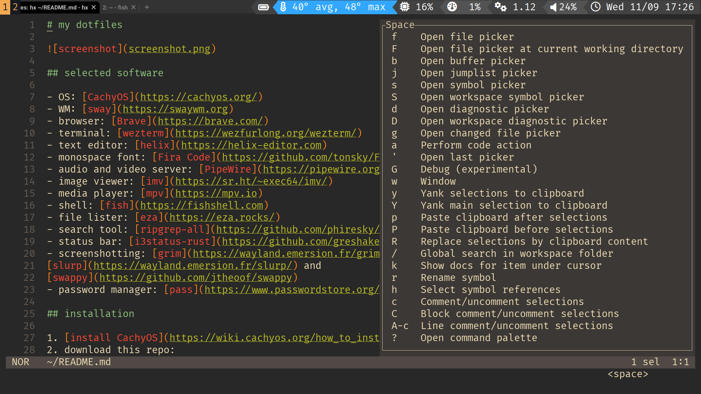

# my dotfiles



## preferred software

- OS: [CachyOS](https://cachyos.org/)
- WM: [sway](https://swaywm.org)
- browser: [Thorium](https://thorium.rocks/)
- terminal: [wezterm](https://wezfurlong.org/wezterm/)
- text editor: [helix](https://helix-editor.com)
- monospace font: [Fira Code](https://github.com/tonsky/FiraCode)
- proportional font: [Fira Sans](https://mozilla.github.io/Fira/)
- audio/video server: [PipeWire](https://pipewire.org)
- image viewer: [imv](https://sr.ht/~exec64/imv/)
- media player: [mpv](https://mpv.io)
- shell: [fish](https://fishshell.com)
- file lister: [exa](https://the.exa.website)
- search tool: [ripgrep-all](https://github.com/phiresky/ripgrep-all)
- status bar: [i3status-rust](https://github.com/greshake/i3status-rust/)
- screenshotting: [grim](https://wayland.emersion.fr/grim/),
[slurp](https://wayland.emersion.fr/slurp/) and
[swappy](https://github.com/jtheoof/swappy)
- password manager: [pass](https://www.passwordstore.org/)

## installation

1. [install CachyOS](https://wiki.cachyos.org/en/home/install-cachyos)
2. download this repo:
    ```fish
    cd
    git init
    git remote add origin https://git.sr.ht/~lincot/dotfiles
    git fetch
    git checkout -f master
    ```
3. install needed packages: `./install.sh`
4. consider doing the
[general system tweaks](https://wiki.cachyos.org/en/home/General_System_Tweaks)
5. consider disabling swap by adding `systemd.zram=0` to kernel cmdline
(in case of systemd-boot add it to `LINUX_OPTIONS` in `/etc/sdboot-manage.conf`
and run `sudo sdboot-manage gen`)
6. [configure Thorium](chromium_configuration.md)

## to begin

1. turn on your PC
2. log in
3. press `Super+Enter` to open terminal
4. launch Thorium: `thorium-browser
--ozone-platform-hint=auto
--ignore-gpu-blocklist
--enable-gpu-rasterization
--enable-zero-copy
--force-dark-mode
--enable-features=WebUIDarkMode
&>/dev/null &disown`
5. move it to the second workspace with `Super+Shift+2`
(so that there is only 1 fullscreen window per workspace)
6. enjoy
